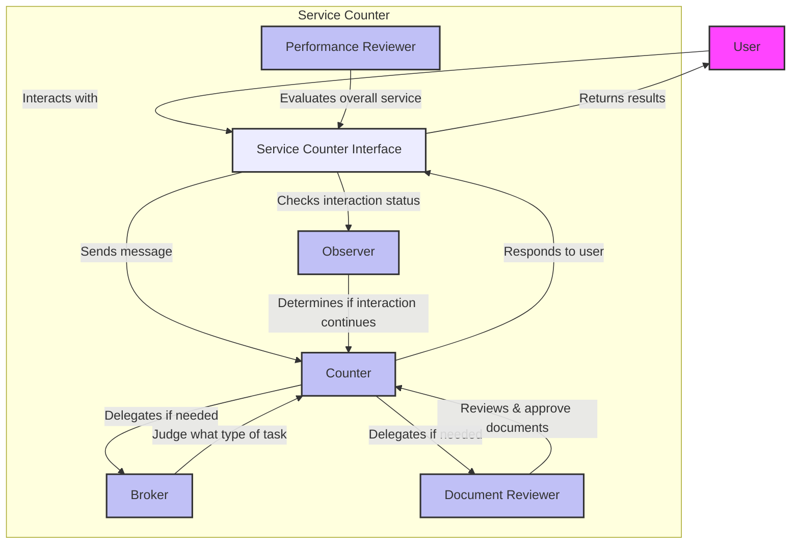

# AI Service Counter

## Overview

This system is designed to provide AI-powered document application services primarily at government and administrative offices in Japan.  
It aims to address service delivery challenges such as language barriers due to increasing immigration, labor shortages due to aging population, and slow digital transformation.  
By distributing counter services among different AI roles and defining task contents abstractly, the system aims to provide services with minimal operational definitions through collaborative AI operations.

## Key Features
- Conducts counter services by understanding user needs through conversation
- Reviews and processes submitted document images from users
- Delegates workflow transitions and service completion decisions to AI
- Evaluates user interactions and establishes feedback cycles for each service role

## Architecture



## Usage
### Environment Setup
```
pyenv install 3.11.0b4
pyenv local 3.11.0b4
pip install -r requirements.txt
export OPENAI_API_KEY=your_api_key
```
The current version only supports OpenAI API and utilizes Vision API.
Counter service definitions are configured in `conf/job_description.json` and `conf/task_details.json`.

First, edit `conf/job_description.json` to define the service content.
```
{
    "workplace": "役所", // The place where services are provided
    "job_type": "書類申請", // Type of service
    "counter": { // Settings for the counter staff
        "collegues": [ // Other AIs that the counter staff can rely on for tasks (currently fixed)
            {
                "name": "reviewer",
                "task": "Refer to the document images submitted by the user, and perform corrections or acceptance. Document images are mandatory."
            },
            {
                "name": "broker",
                "task": "Provide detailed information about documents that can be corrected or accepted in line with the user's request."
            }
        ]
    },
    "broker": {}, // Settings for the broker
    "reviewer": { // Settings for the reviewer
        "indicators": [ // Evaluation criteria for the reviewer at the end of the series of counter operations
            {
                "name": "counter_performance", // Evaluation of the counter staff
                "definition": "A rating from 1 to 4 (low, medium, high, very high)" // Definition of the evaluation
            },
            {
                "name": "broker_performance", // Evaluation of the broker
                "definition": "A rating from 1 to 4 (low, medium, high, very high)" // Definition of the evaluation
            },
            {
                "name": "reviewer_performance", // Evaluation of the reviewer
                "definition": "A rating from 1 to 4 (low, medium, high, very high)" // Definition of the evaluation
            },
            {
                "name": "observer_performance", // Evaluation of the observer
                "definition": "A rating from 1 to 4 (low, medium, high, very high)" // Definition of the evaluation
            },
            {
                "name": "overall_performance", // Evaluation of the entire counter operation
                "definition": "A rating from 1 to 4 (low, medium, high, very high)" // Definition of the evaluation
            }
        ]
    }
}

```

Next, edit `conf/task_details.json` to define the details of tasks performed by each AI role.
In this example, two application processes are defined: move-in notification and move-out notification.
A correct image must be prepared for each defined task, which is compared against the documents submitted by users.
```
{
    "tasks": [
        {
            "task_number": 1, // Task number determined by the broker
            "task_name": "Processing a Move-In Notification", // Name of the task
            "task_content": "Provide the move-in notification form to the user, guide them on how to fill it out, and accept the submission.", // Content of the task
            "task_status": [ // Status of the task
                "review", // Status before accepting the user's application
                "start", // Status after accepting the user's application
                "accepted" // Status when the user's application is accepted
            ],
            "correct_img_path": "conf/correct_img/1.png" // Path to the correct document image !!The file name must match the task number!!
        },
        {
            "task_number": 2,
            "task_name": "Processing a Move-In Notification",
            "task_content": "Provide the move-in notification form to the user, guide them on how to fill it out, and accept the submission.",
            "task_status": [
                "review",
                "start",
                "accepted"
            ],
            "correct_img_path": "conf/correct_img/2.png"
        }
    ]
}
```

### How to Run
```
python launch_servicecounter.py --job_path "conf/job_description.json" --task_path "conf/task_details.json" --model "gpt-4o-2024-08-06" --result_path "performance_result/result.json" --script_history_dir "performance_result"
```
- task_path: Storage location for task_details.json
- job_path: Storage location for job_description.json
- model: Model to use (OpenAI models with Vision API support only)
- result_path: Storage directory for result.json (reviewer evaluations)
- script_history_dir: Storage directory for conversation logs
