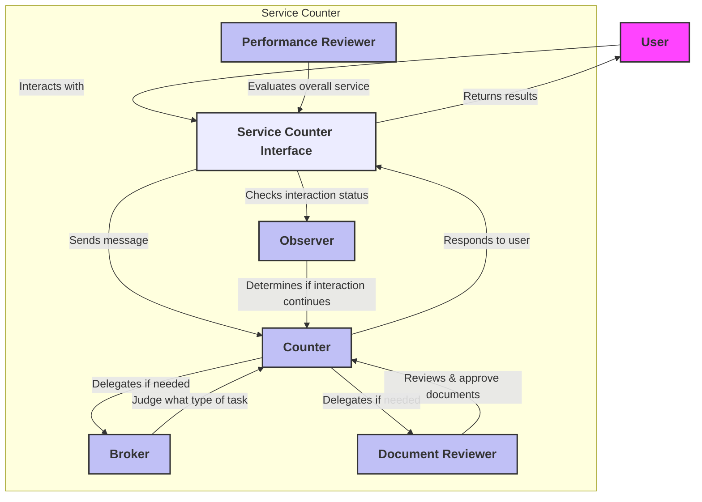

# AI Service Counter

## 概要

主に日本の役所・行政機関における書類申請窓口での業務をAIで提供することを想定している。  
移民が増えることでの言語的な障壁、高齢化による人手不足やデジタル化が進まないこと等によるサービス提供上の課題を解消することを目指している。  
また、窓口業務を各役割のAIに分担した上でタスク内容を抽象的に定義し、それらを協調動作させることで、業務の最低限の定義でもサービスを提供できるようにすることを目指している。  

## 主な特徴
- ユーザーとの会話を通して、ユーザーの要望を汲み取り、それに合わせて窓口業務を行う。
- ユーザーから申請された書類画像を参照し、訂正・受理を行う。
- 一連の窓口業務フロー遷移の一部と、窓口業務の終了判断をAIに任せる。
- ユーザーとの一連の会話を評価し、各担当者のフィードバックサイクルを構築する。

## アーキテクチャ



## 使い方
### 環境構築
```
pyenv install 3.11.0b4
pyenv local 3.11.0b4
pip install -r requirements.txt
export OPENAI_API_KEY=your_api_key
```
現バージョンでは、OpenAI APIのみ利用可能。Vision APIを利用している。  
窓口業務の定義は、`conf/job_description.json`と`conf/task_details.json`で行う。  

まずは、`conf/job_description.json`を編集して、サービスの内容を定義する。
```
{
    "workplace": "役所", // サービスを提供する場所
    "job_type": "書類申請", // サービスの種類
    "counter": { // 窓口対応者の設定
        "collegues": [ // 窓口対応者が業務を頼める他AI(現実装は固定)
            {
                "name": "reviewer",
                "task": "ユーザーから申請された書類画像を参照し、訂正・受理を行う。書類画像が必須である。"
            },
            {
                "name": "broker",
                "task": "ユーザーの要望と一致する、訂正・受理できる書類の詳細を提示する。"
            }
        ]
    },
    "broker": {}, // brokerの設定
    "reviewer": { // reviewerの設定
        "indicators": [ // 一連の窓口業務終了時に、reviewerが行う評価の指標
            {
                "name": "counter_performance", // 窓口対応者の評価
                "definition": "A rating from 1 to 4 (low, medium, high, very high)" // 評価の定義
            },
            {
                "name": "broker_performance", // brokerの評価
                "definition": "A rating from 1 to 4 (low, medium, high, very high)" // 評価の定義
            },
            {
                "name": "reviewer_performance", // reviewerの評価
                "definition": "A rating from 1 to 4 (low, medium, high, very high)" // 評価の定義
            },
            {
                "name": "observer_performance", // observerの評価
                "definition": "A rating from 1 to 4 (low, medium, high, very high)" // 評価の定義
            },
            {
                "name": "overall_performance", // 一連の窓口業務の評価
                "definition": "A rating from 1 to 4 (low, medium, high, very high)" // 評価の定義
            }
        ]
    }
}

```

次に、`conf/task_details.json`を編集して、各AI役割者が行うタスクの詳細を定義する。  
例では、転入届と転出届の2つの申請処理を定義している。  
定義されたタスクごとの正解画像を用意する必要があり、これをユーザーの提出書類と比較している。  
```
{
    "tasks": [
        {
            "task_number": 1, // brokerが判断するタスクの番号
            "task_name": "転入届処理", // タスクの名前
            "task_content": "ユーザーに転入届の提供・記入指導・受付を行ってください。", // タスクの内容
            "task_status": [ // タスクの状態
                "review", // ユーザーからの申請を受け付ける前の状態
                "start", // ユーザーからの申請を受け付けた後の状態
                "accepted" // ユーザーからの申請を受理した状態
            ],
            "correct_img_path": "conf/correct_img/1.png" // 正しい書類画像のパス !!ファイル名はタスク番号と一致させる!!
        },
        {
            "task_number": 2,
            "task_name": "転入届処理",
            "task_content": "ユーザーに転入届の提供・記入指導・受付を行ってください。",
            "task_status": [
                "review",
                "start",
                "accepted"
            ],
            "correct_img_path": "conf/correct_img/2.png"
        }
    ]
}

### 実行方法
```
python launch_servicecounter.py --job_path "conf/job_description.json" --task_path "conf/task_details.json" --model "gpt-4o-2024-08-06" --result_path "performance_result/result.json" --script_history_dir "performance_result"
```
- task_path: task_details.jsonの格納先
- job_path: job_description.jsonの格納先
- model: 使用するモデル(Vision APIが使えるOpenAIモデルのみ)
- result_path: result.json(reviewerの評価)の格納先ディレクトリ
- script_history_dir: 会話ログの格納先ディレクトリ
